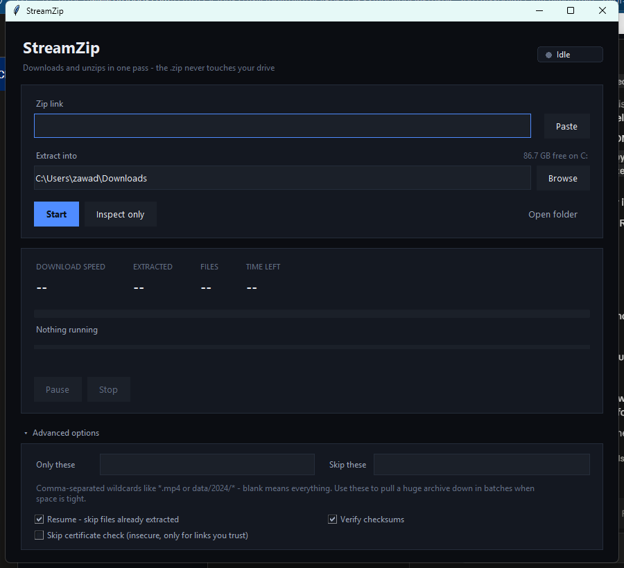
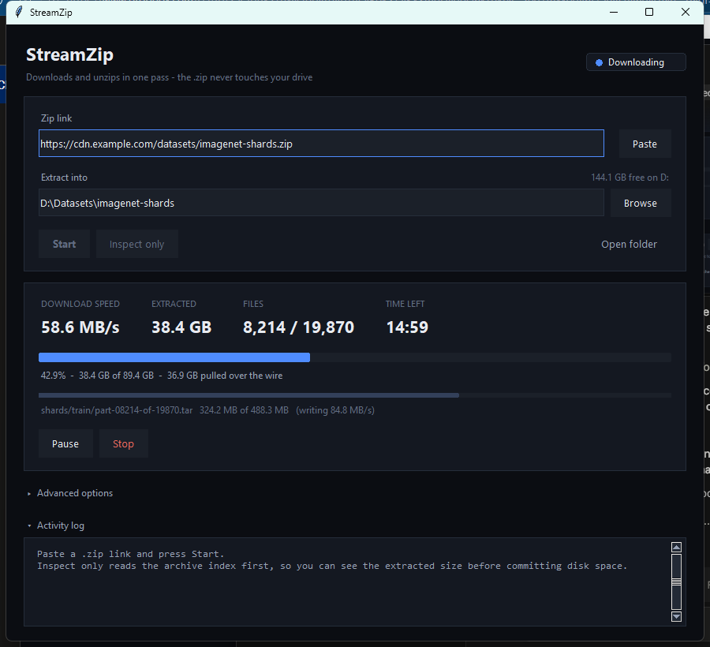

# StreamZip

Paste a link to a `.zip`, get the extracted files. The archive itself is never
written to disk.

```
95 GB zip  +  ~100 GB extracted  =  ~195 GB of free space, the normal way
~100 GB extracted alone                                  =  what StreamZip needs
```

Each member is fetched over HTTP and inflated in a 1 MiB window as the bytes
arrive; only the extracted files ever touch the disk. At most a few MB of the
archive exists at any moment, in RAM.

<p align="center">
  
  
</p>

## Get it

**Windows, no Python required:** grab `StreamZip.exe` from the
[latest release](https://github.com/zawad-monsur/StreamZip/releases/latest)
and run it.

> Windows may show a SmartScreen warning ("isn't commonly downloaded") the
> first while — that's based on how many people have downloaded this exact
> file before, not a malware detection. It's normal for any new executable
> without a paid code-signing certificate. Click **More info → Run anyway**
> if you trust the source, or skip the exe entirely and run from source
> below, which never triggers it.

**From source** (Windows, and likely Linux/macOS — see
[Platform notes](#platform-notes)):

```bash
git clone https://github.com/zawad-monsur/StreamZip.git
cd StreamZip
python app.py
```

Or on Windows, just double-click `StreamZip.bat`. Needs Python 3.8+ with
Tkinter (the default install on Windows) — no packages to install, no
dependencies to pull in.

## Using it

1. Paste the URL. The destination folder auto-names itself after the archive.
2. **Inspect only** reads just the index (a few KB) and reports the member
   count, extracted size, and your free space — before anything downloads.
3. **Start**. Pause and Stop work throughout the transfer.

Advanced options (open by default):

- **Only these / Skip these** — comma-separated wildcards (`*.mp4`,
  `data/2024/*`). Use these to pull a big archive down in batches when the
  contents won't fit all at once: extract a slice, move it off the drive,
  extract the next.
- **Resume** — skip files already extracted at the right size on a re-run.
- **Header** — one raw request header for links behind a login, e.g.
  `Cookie: session=abc123` or `Authorization: Bearer ...`.
- **Skip certificate check** — a last resort for a link you trust when TLS
  verification can't be fixed another way. See [Certificate errors](#certificate-errors).

## Two modes

Picked automatically based on what the server supports.

| | Range-capable server | Range-ignoring server |
|---|---|---|
| File list before downloading | yes | no |
| Space check before downloading | yes | no |
| Resume a stopped run | yes | no |
| Extract only some members | yes | no (whole archive streams past) |
| Zip never hits disk | yes | yes |

Most real download hosts (S3, CloudFront, GitHub releases, nginx, Apache)
support byte-range requests. The sequential fallback parses local file headers
as they go by — it still never writes the zip, it just gives up the extras.

## Performance

One persistent HTTP connection is reused for the whole run, and any redirect
is resolved once and cached rather than re-followed on every request. For an
archive with many small members this matters far more than raw bandwidth: on
a 60-file test archive, a naive new-connection-per-request implementation
opened around 120 TCP connections; StreamZip opens 1.

## Reliability

- **Dropped connections** reconnect and resume at the exact byte, keeping the
  decompressor's in-memory state — a network blip during a 40 GB member costs
  a retry, not a restart. 8 retries with exponential backoff; a stale
  keep-alive connection gets one free immediate retry before that budget
  starts counting.
- **CRC-32 is verified** per member. Files land as `.streamzip-part` and are
  renamed only after size and checksum both check out, so a half-written file
  never masquerades as a finished one.
- **Zip64** throughout, so archives past 4 GB and past 65,535 members work.
- **Path traversal** (`../`) in member names is rejected. Windows-illegal
  characters and reserved device names (`CON`, `NUL`, ...) are remapped; long
  paths use the `\\?\` prefix so Windows' 260-character limit doesn't bite.

## Certificate errors

If **Inspect only** fails with `CERTIFICATE_VERIFY_FAILED: unable to get local
issuer certificate`, that's usually Windows, not the site.

Windows keeps a *partial* copy of its root certificates on disk and fetches
the rest from Windows Update on demand. Python's bundled OpenSSL reads only
the on-disk copy and can't trigger that fetch, so it sees a few dozen roots
where Windows itself has hundreds, and otherwise-valid sites fail to verify.

Press **Fix certificates**. It runs `pip install truststore certifi` (about
200 KB, one time). After that the app defers to Windows' own certificate
validation and the error goes away — press Inspect again.

The **Skip certificate check** box disables verification entirely, so the
connection is no longer protected against interception. Only use it for a
link you trust and can't fix another way.

## Not supported

Password-protected archives, and compression methods other than store and
deflate (bzip2, LZMA, zstd, deflate64). Both are reported by name before
anything is written.

## Files

| | |
|---|---|
| `core.py` | the engine — HTTP, Zip64 parsing, streaming inflate. No GUI imports, no third-party dependencies. |
| `app.py` | the Tkinter window. |
| `theme.py` | the dark-mode visual layer the window is built from. |
| `StreamZip.bat` | Windows launcher. |

`core.py` stands alone if you want to script it:

```python
import core
job = core.Job("https://host/big.zip", r"D:\out", include=["*.csv"])
job.run()
```

## Packaging to a single .exe

Optional — the `.bat` is enough for local use.

```bash
pip install pyinstaller
pyinstaller --onefile --windowed --name StreamZip app.py
```

## Platform notes

Built and tested on Windows. The engine and GUI are plain Python and Tkinter
with no Windows-only dependencies, and the Windows-specific bits (long-path
handling, reserved filename remapping) are already gated behind `os.name`
checks — so it likely runs on Linux and macOS as-is, just unverified there.
Issues and PRs confirming or fixing cross-platform behavior are welcome.

## Contributing

Issues and pull requests are welcome. `core.py` has no dependencies outside
the standard library by design — keep it that way unless there's a strong
reason not to.

## License

[MIT](LICENSE)
